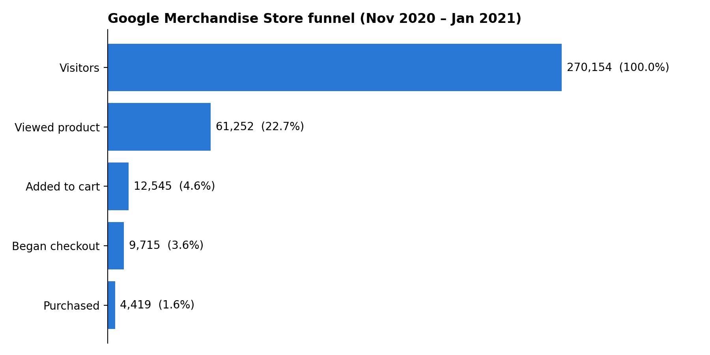
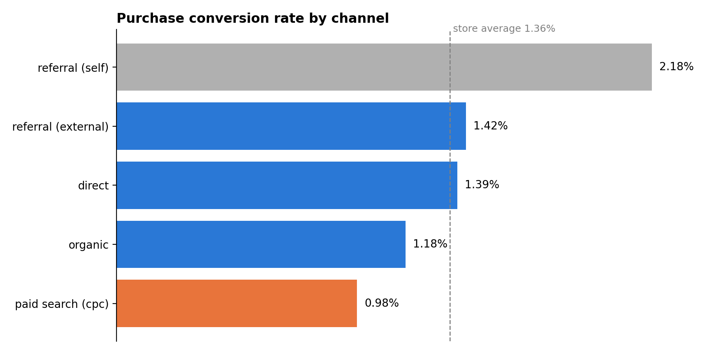
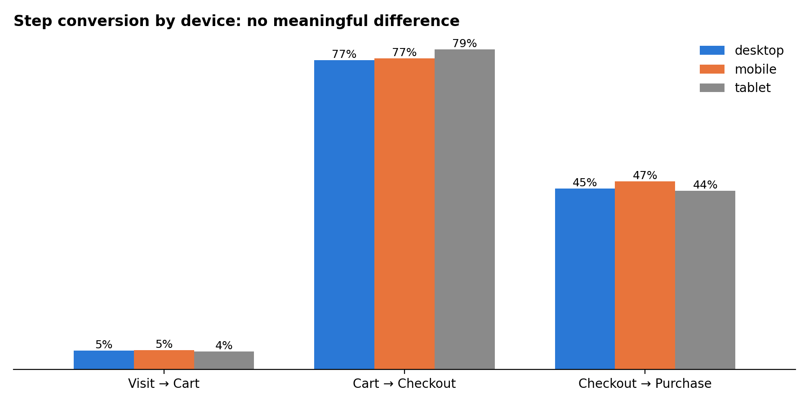

# Where do online shoppers drop off?

A GA4 e-commerce funnel analysis of the Google Merchandise Store, built with SQL (BigQuery) and Python.

## The business question

Only a small share of visitors to an online store ever buy something. Where in the journey do they drop off, and which acquisition channels and devices bring customers who actually convert?

## Data

- **Source:** Google's public GA4 sample dataset, `bigquery-public-data.ga4_obfuscated_sample_ecommerce`
- **Store:** Google Merchandise Store (Google's official online shop for branded merchandise)
- **Period:** 1 Nov 2020 – 31 Jan 2021
- **Size:** 270,154 users, 4.3M events
- **Note:** Google obfuscated the data for privacy, so some traffic sources appear as `<Other>` or `(data deleted)`. These rows were excluded from the channel comparison.

## Method

1. **SQL (BigQuery):** built a five-step purchase funnel (visit → product view → add to cart → checkout → purchase) by counting unique users per GA4 event with `COUNT(DISTINCT IF(...))`, then segmented it by acquisition channel and device.
2. **Data quality check:** broke referral traffic down by source to test whether the channel's strong result held up.
3. **Python (Colab):** pulled the query results into pandas and visualized them with matplotlib.

## Key findings

### 1. The biggest drop-off happens before shoppers see a product

| Step | Users | Continued from previous step |
|---|---|---|
| Visited | 270,154 | |
| Viewed a product | 61,252 | 22.7% |
| Added to cart | 12,545 | 20.5% |
| Began checkout | 9,715 | 77.4% |
| Purchased | 4,419 | 45.5% |

Overall conversion is **1.6%**. **77% of visitors leave without viewing a single product**, so landing pages and navigation are the largest opportunity. More than half of shoppers who start checkout still don't buy.

### 2. Paid search converts worst, and referral's lead was mostly a tracking artifact

- **Paid search (cpc) has the lowest conversion rate (0.98%)**, below the 1.36% average of the channels shown. The store pays for its least-converting traffic.
- At first, referral looked like the best channel. Breaking it down by source showed that **about 44% of referral users came from the store's own domain** (`shop.googlemerchandisestore.com`). This pattern points to a self-referral tracking issue, typically caused by users returning from checkout or payment pages.
- **External referral (1.42%) converts about the same as direct traffic (1.39%).**
- Organic search brings the most visitors but converts below average (1.18%), so even small improvements there would have the largest impact.

### 3. Device is not the problem

Mobile (1.70%) converts as well as desktop (1.60%), and the checkout-to-purchase rate is almost identical across devices (44–47%). **The checkout drop-off is a process problem, not a mobile UX problem.**

## Recommendations

1. **Improve landing pages and product discovery.** The first step loses the most users.
2. **Investigate the checkout step** (shipping costs, forced account creation, payment options). About 55% of users drop off there on every device.
3. **Review paid search targeting**, since it is the lowest-converting channel.
4. **Fix the self-referral tracking** by adding the store's own domain and payment providers to GA4's list of unwanted referrals. This keeps channel reports accurate.

## Tools

BigQuery (SQL) · Python (pandas, matplotlib) · Google Colab · GA4

## Files

- `queries.sql`: all SQL queries
- `ga4_funnel_analysis.ipynb`: Colab notebook with the Python analysis and charts
- `funnel.png`, `channels.png`, `devices.png`: charts
